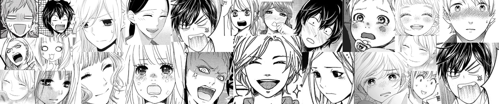

# Manga-Facial-Expression-Classifier

  

## Dataset Context

There are many human facial expression datasets but for mangas (japanese comics) there are none. I hope this tiny dataset would be a good starting point to show the power of manga faces to reflect emotions.

## Dataset Content
The dataset consists of several emotions (The number next to them is count of it):
<li> Pleased (38)
<li> Angry (54)
<li> Crying (56)
<li> Sad (57)
<li> Embarrassed (67)
<li> Happy (87)
<li> Shock/Surprised (103)

## Classifier
Manga facial expression classifier Kaggle notebook can be found on [here](https://www.kaggle.com/mertkkl/pytorch-manga-facial-expression-classification
)

## Thanks

Huge Thanks to Aslihan Bilge Solak for helping me to create this dataset

For labeling I have created a tiny program to label easily which can be found [here](https://github.com/justmert/Classification-Labeler)  